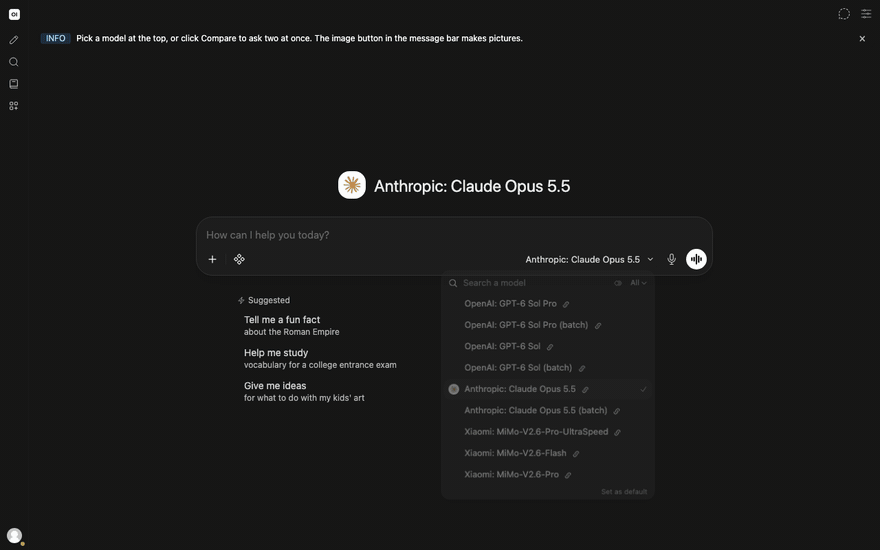

<p align="center">
  
</p>

<p align="center">
  <strong>One chat to rule them all.</strong>
</p>

<p align="center">
  <a href="LICENSE"></a>
  
  
  
  <a href="https://github.com/segraef/sec-kit"></a>
</p>

**omn1** is one chat for all AI models. Pick any model, switch any time, and create text, images, video and music, in the cloud through OpenRouter or locally with Ollama. Built on [Open WebUI](https://github.com/open-webui/open-webui).

<p align="center">
  
</p>

<p align="center">
  
</p>

## What you need

- An API key from the gateway you prefer: [OpenRouter](https://openrouter.ai/keys), [Requesty](https://requesty.ai), [Hugging Face](https://huggingface.co/settings/tokens) or any other OpenAI-compatible one (add it in omn1 under Admin Panel > Settings > Connections; OpenRouter is set up by default)
- Docker, anywhere: locally on your Mac or PC, or in the cloud on a small VM (Azure, AWS, any provider) or Azure Container Apps (with an Azure Postgres database for the chats)

## Quick start

```bash
docker compose up -d
```

## Local models (optional)

Install [Ollama](https://ollama.com/download), then pull a model:

```bash
ollama pull huihui_ai/qwen3-abliterated:8b
```

Reload omn1 and the model shows up in the model picker next to the OpenRouter models.

## FAQ

**What does omn1 add over OpenRouter's own chat?**

For casual chatting, OpenRouter's chat is plenty. omn1 makes the difference when you want:

1. **Self-hosted:** runs on your machine or in your own cloud, and your chats stay in your own database.
2. **Gateway independence:** not only OpenRouter. Any OpenAI-compatible gateway (Requesty, AIML API, Hugging Face, ...) plugs in as another connection.
3. **Local models:** Ollama models, including abliterated ones, right next to the cloud models.

MIT licensed. See [`LICENSE`](LICENSE).
