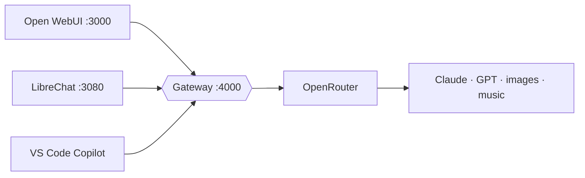

<p align="center">
  
</p>

<p align="center">
  <strong>Your own multi-model chat. Two chat apps in front, one gateway in the middle, every model through OpenRouter.</strong>
</p>

<p align="center">
  <a href="LICENSE"></a>
  
  
  
  <a href="https://github.com/segraef/sec-kit"></a>
</p>

*Weiche* is German for a railway switch. Every app talks to one gateway, and the gateway sends each message to whichever model you picked. The apps only see short, stable names like `claude-opus-5.5`. Which model sits behind each name is one line in `.env`.



## Quick start

Needs Docker Desktop, `curl`, `jq`, `openssl`.

```bash
./scripts/init.sh                 # creates .env with random secrets
# put your OPENROUTER_API_KEY in .env
docker compose --profile openwebui --profile librechat up -d
./scripts/smoke-test.sh           # one call per model, pass/fail
```

Open WebUI: http://localhost:3000 · LibreChat: http://localhost:3080. The first account you create in each is the admin. Start only one app by leaving out the other `--profile`.

## Models

| Name in the apps  | OpenRouter model             |
| ----------------- | ---------------------------- |
| `claude-opus-5.5` | `anthropic/claude-opus-5.5`  |
| `gpt-5.6-sol`     | `openai/gpt-5.6-sol`         |
| `gpt-5.6-luna`    | `openai/gpt-5.6-luna`        |
| `gpt-image`       | `openai/gpt-5-image`         |
| `lyria-3-pro`     | `google/lyria-3-pro-preview` |

To swap a model, change its line in `.env` and run `docker compose up -d litellm`. Only the gateway restarts; the apps stay up.

## Images

- **Open WebUI:** image button in the message bar.
- **LibreChat:** images come from an agent. Agents > new agent > pick a Gateway model > add **OpenAI Image Tools** > save, then ask it for a picture.

## VS Code / GitHub Copilot

Use the same models in Copilot Chat and agent mode:

1. Command Palette > **Chat: Manage Language Models** > **Add Models** > **Custom Endpoint**.
2. Paste [`vscode/chatLanguageModels.json`](vscode/chatLanguageModels.json). When asked for the key, use `LITELLM_MASTER_KEY` from `.env`.

Limits: this covers chat and agent mode, not inline code completions. On Copilot Business/Enterprise an org admin must allow "bring your own key".

## Using your Azure credits

No code change needed. In OpenRouter's BYOK settings, add your Microsoft Foundry resource as an Azure key with `"resource_type": "ai_foundry"`. OpenRouter then calls your deployments first and falls back to its own capacity.

- **Deployment names must match.** Name each deployment exactly like OpenRouter's Azure name for that model (listed on [openrouter.ai/provider/azure](https://openrouter.ai/provider/azure)), e.g. `claude-opus-5-5`, `gpt-5.6-sol`. A differently named deployment isn't found, and the request quietly runs on OpenRouter's capacity at full price instead.
- **Test it first:** set the key to never use shared capacity, send a few messages, and check OpenRouter's Activity page. Each request should show as BYOK.
- Prompts pass through OpenRouter even when Foundry answers. Images (`gpt-image`) are not served through Azure on OpenRouter.

## Run it in Azure

- **Cheapest: a small Linux VM.** Same compose file on a B2s VM with Docker. Turn on auto-shutdown and deallocate when idle, so you pay only for the disk. Keep ports private (Bastion, Tailscale) or put Caddy with HTTPS in front.
- **Serverless: Azure Container Apps.** Gateway plus one app, both scale to zero. Gateway gets internal ingress only. Put Entra ID (Easy Auth) in front of the app and keep keys in Key Vault. Open WebUI is the easier fit (Postgres Flexible Server for its data). LibreChat also needs MongoDB (Cosmos DB for MongoDB vCore) and Meilisearch.

## Known gaps

- **Music:** `lyria-3-pro` is reachable through the gateway, but neither app plays generated audio. A small music page calling the gateway would close this.
- **Video:** not wired. Candidates on OpenRouter: Veo 3.1, Sora 2 Pro.
- **`gpt-image-1`:** OpenRouter serves it only on a separate images API the gateway doesn't support yet, so `gpt-image` uses `gpt-5-image` (same image engine, reached through chat).

## Layout

```
docker-compose.yml   gateway + app profiles, pinned versions, healthchecks
gateway/config.yaml  model names the apps see, mapped to the OpenRouter IDs in .env
librechat/           librechat.yaml: the "Gateway" endpoint, welcome text, title model
scripts/             init.sh (create .env), smoke-test.sh (call every model)
vscode/              Copilot custom endpoint snippet
```

MIT licensed. See [`LICENSE`](LICENSE).
