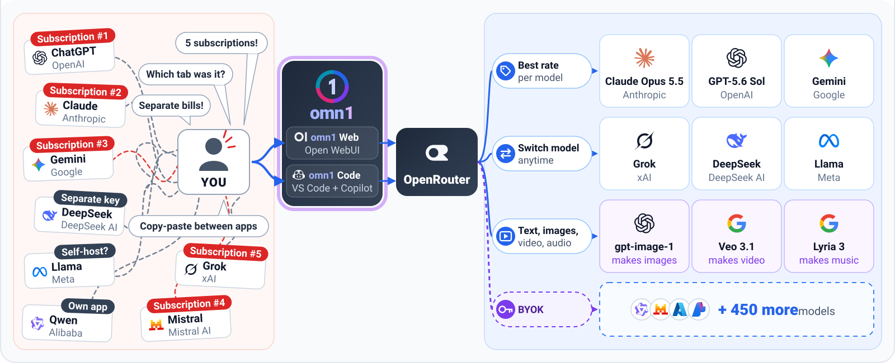

<p align="center">
  
</p>

<p align="center">
  <strong>One chat to rule them all.</strong>
</p>

<p align="center">
  <a href="LICENSE"></a>
  
  
  
  <a href="https://github.com/segraef/sec-kit"></a>
</p>

**omn1** is your own AI hub: every model on OpenRouter at the best rate, switch any time, and one web UI for text, images, video, music and read-aloud ([add-ons](addons/)). The same key works in VS Code as **omn1 Code**. Built on [Open WebUI](https://github.com/open-webui/open-webui).

<p align="center">
  
</p>

## Quick start

```bash
docker compose up -d
```

Open http://localhost:3000, create your account (the first one is the admin), then paste your [OpenRouter key](https://openrouter.ai/keys) under Admin Panel > Settings > **Connections** and **Images**.

MIT licensed. See [`LICENSE`](LICENSE).
